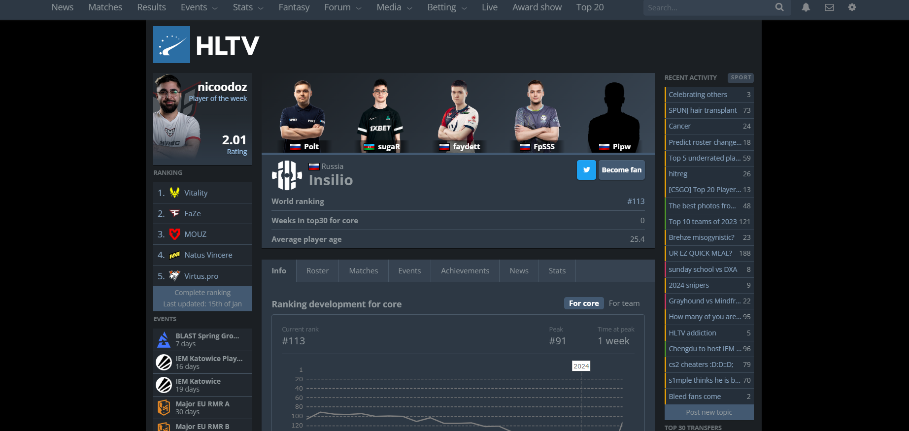
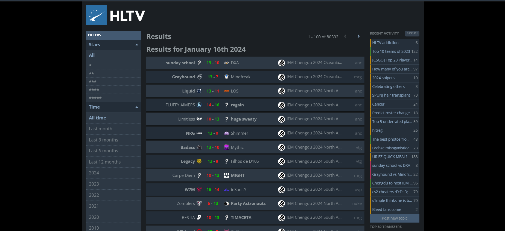
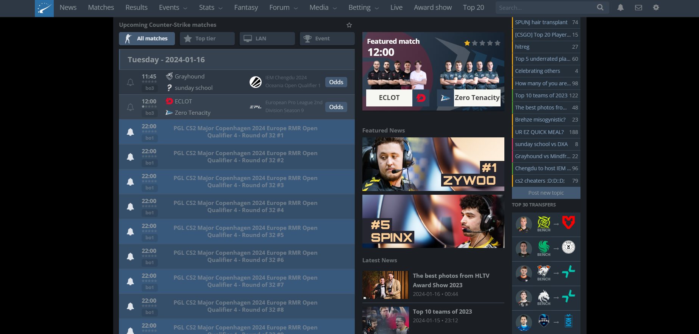

# HLTV.ORG
 
 = 
 Название продукта
 =
 - hltv.org

Краткое описание
=

- hltv.org -  популярный ресурс для киберспортивных новостей и статистики. Он предназначен для тех, кто интересуется киберспортом и хочет получать последние новости и информацию о турнирах и командах.

Необходимые условия для использования продукта 
=
- Для использования продукта достаточно перейти по ссылке https://www.hltv.org

Как установить программу 
=
- Устанавливаете любой браузер по вашему вкусу и переходите по ссылке https://www.hltv.org

Порядок использования 
=

- Функции, предоставленные на сайте:
1) Просматривать последние новости о киберспорте

2) Искать информацию о командах, игроках и турнирах

3)  расписание предстоящих матчей и результаты прошлых матчей

4) Устанавливать уведомления о важных событиях и матчах
